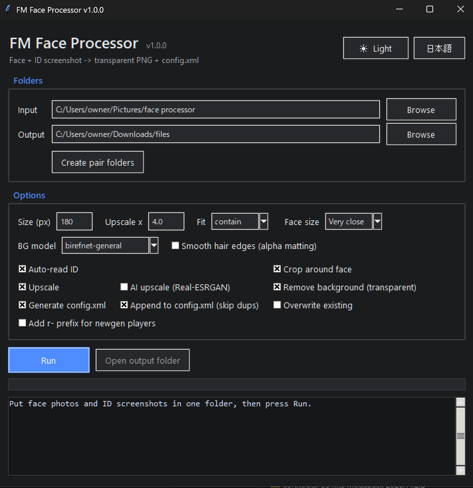
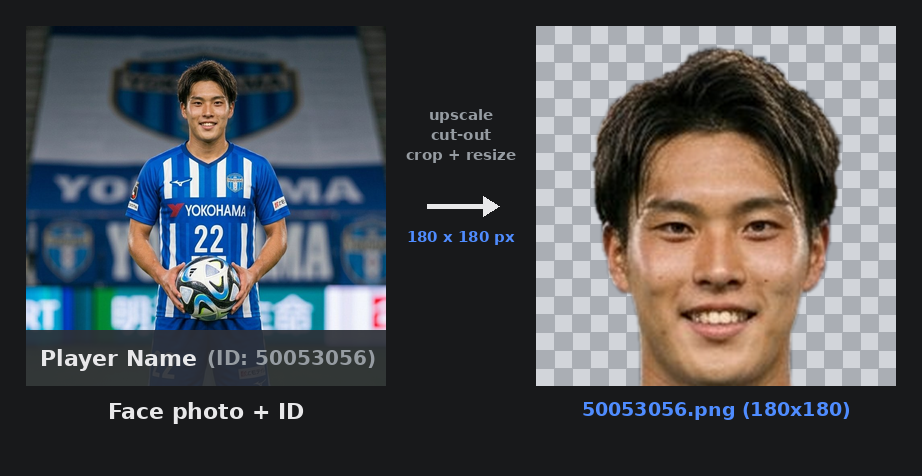

# FM Face Processor

顔写真とID入りスクショを入れるだけで、背景を抜いて顔を切り抜き、Football Manager用のファイル一式を作るツールです。
*Drop in a face photo and an ID screenshot — it removes the background, crops the face, and builds the files for Football Manager.*



---

## 日本語

### これは何？
FM（Football Manager）の選手・スタッフの顔グラフィックを半自動で作るツールです。顔写真と、その人のFM内ID（例: `ID: 50053056`）が写ったスクショを用意するだけで、高画質化・背景透過・顔まわりの切り抜き・サイズ調整をして、`config.xml` まで自動で作ります。



> サンプル画像はAI生成（Google Gemini）の人物で、実在の選手ではありません。

### できること
- 画像を拡大（高画質化）
- 背景を消して透過PNG化（モデル選択・髪のフチ調整あり）
- 顔を中心に、肩を出さず首あたりで切る正方形トリミング
- IDスクショから番号を自動で読み取り、`その番号.png` で保存
- `config.xml` を自動生成（実行のたび書き足し、同じIDは無視）
- 生成選手（newgen）に対応（IDへ `r-` を付ける）
- 日本語／英語の切替、ダーク／ライト切替、設定の保存

### 使い方
1. フォルダに「顔写真」と「IDスクショ」を入れる（ペアごとにサブフォルダに分けると確実）
2. アプリで入力フォルダを選んで「実行」を押す
3. 出力フォルダに、透過PNG一式と `config.xml` ができる
4. それをFMのグラフィックフォルダに入れて、ゲーム内でスキンを再読み込み

### 最初の準備（1回だけ）
1. **Python Install Manager** を入れる（Microsoft Storeで「Python Install Manager」を検索して「入手」。これが今の公式の推奨方法です）
2. インストール後にコマンドプロンプトを開く（**画面左下のスタートボタン（Windowsロゴ）を押す → そのまま `cmd` とキーボードで打つ → 出てきた「コマンドプロンプト」をクリック**）。開いたら3.12を入れる:
   ```
   py install 3.12
   ```
   - 途中で y/n を聞かれたら: `Add commands directory to your PATH now?` → **y** ／ `Install CPython now?` → **n**（最新版が入るのを避けるため）／ `View online help?` → **n**
   - `py list` で 3.12 が出ればOK
3. 必要なライブラリを入れる:
   ```
   py -3.12 -m pip install pillow "rembg[cpu]" rapidocr-onnxruntime opencv-python
   ```
4. `FM Face Processor.py` をダブルクリックで起動
   - ダウンロードした **ファイルはすべて同じフォルダにまとめておいてください**（顔検出モデル `face_detection_yunet_2023mar.onnx` も同じ場所にあると、より正確に顔を検出します）

### 困ったとき
- **背景が抜けない** → `py -3.12 -m pip install "rembg[cpu]"` を実行し、アプリのウィンドウを一度閉じてから開き直す（PCの再起動ではありません）
- **IDが読めない** → 「IDを自動で読み取る」のチェックを外し、ファイル名をIDにしておく（例: `50053056.jpg`）
- **顔が大きすぎ／切れる** → 「顔の大きさ」を一段戻す
- 最初の実行だけ、AIモデルの自動ダウンロードで時間がかかります（以降は速い）

---

## English

### What is this?
A semi-automatic tool for making player/staff face graphics for Football Manager. Give it a face photo and a screenshot showing that person's in-game ID (e.g. `ID: 50053056`); it upscales the image, removes the background, crops around the face, resizes, and builds `config.xml` for you.

> The sample image uses an AI-generated person (Google Gemini), not a real player.

### Features
- Upscale images
- Remove background to a transparent PNG (selectable model, hair-edge smoothing)
- Square crop centered on the face, cut at the neck (no shoulders)
- Auto-read the ID from the screenshot and save as `<ID>.png`
- Auto-generate `config.xml` (appends each run, skips duplicate IDs)
- Newgen support (adds an `r-` prefix to the ID)
- Japanese/English toggle, dark/light theme, saved settings

### How to use
1. Put face photos and ID screenshots in a folder (use one subfolder per pair for reliability)
2. Select the input folder in the app and press **Run**
3. The output folder gets the transparent PNGs and `config.xml`
4. Drop those into your FM graphics folder and reload the skin in-game

### First-time setup (once)
1. Install the **Python Install Manager** (search "Python Install Manager" in the Microsoft Store and click Get — this is the current recommended method)
2. After installing, open Command Prompt (**click the Start button / Windows logo at the bottom-left, type `cmd` on the keyboard, then click "Command Prompt"**), and install 3.12:
   ```
   py install 3.12
   ```
   - If prompted with y/n: `Add commands directory to your PATH now?` → **y**; `Install CPython now?` → **n** (avoids installing the newest version); `View online help?` → **n**
   - Run `py list` and confirm 3.12 appears
3. Install the required libraries:
   ```
   py -3.12 -m pip install pillow "rembg[cpu]" rapidocr-onnxruntime opencv-python
   ```
4. Double-click `FM Face Processor.py` to launch
   - **Keep all downloaded files together in one folder** (with the face model `face_detection_yunet_2023mar.onnx` in the same place, faces are detected more accurately)

### Troubleshooting
- **Background not removed** → run `py -3.12 -m pip install "rembg[cpu]"`, then close and reopen the app window (not a PC restart)
- **ID not detected** → uncheck "Auto-read ID" and name the file as the ID (e.g. `50053056.jpg`)
- **Face too big / cut off** → step the "Face size" down one level
- The first run downloads AI models, so it's slow once; later runs are fast

