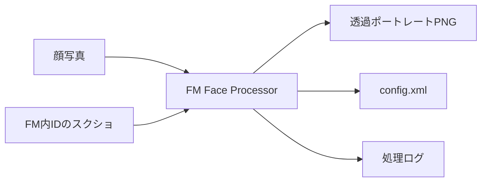
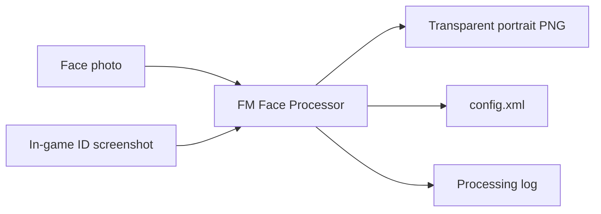

<div align="center">
  
  <h1>FM Face Processor</h1>
  <p><strong>顔写真 + IDスクショ → FMポートレート + config.xml を自動生成<br>Face photo + ID screenshot → FM portrait + config.xml</strong></p>
  <p><a href="#日本語">日本語</a> · <a href="#english">English</a></p>
</div>

<div align="center">

[](https://www.microsoft.com/windows)
[](https://www.python.org/)
[](LICENSE)
[](https://github.com/kumajia/FM-Face-Processor/releases/latest)

</div>

---

## 日本語

Football Manager用の選手・スタッフ顔グラフィックを半自動で作るWindowsアプリです。顔写真とFM内IDのスクリーンショットを入力すると、高画質化・背景透過・顔トリミング・`config.xml`生成までまとめて行います。

### クイックスタート

1. [最新のReleasesページ](https://github.com/kumajia/FM-Face-Processor/releases/latest)から、名前が `_Windows.zip` で終わるファイルをダウンロードする
2. ZIPを完全に展開する
3. `EXE\FM Face Processor\FM Face Processor.exe`をダブルクリックする

**EXE版はPython不要です。** `FM Face Processor.exe`だけを移動せず、フォルダ一式のまま使用してください。

> 初めてローカル背景除去モデルを使用するときは、モデル取得のためインターネット接続と空き容量が必要です。remove.bgを有効にした場合のみ、処理対象の顔画像がremove.bgへ送信されます。

### 対応環境

- Windows版Football Managerで、カスタムグラフィックと`config.xml`を利用できる環境
- EXE版: Python不要。専用GPUは必須ではありませんが、処理速度はPC性能と選択機能により変わります
- ソース版: 64bit版Python 3.12
- 初回モデル取得、remove.bg利用、ソース版のライブラリ準備にはインターネット接続が必要

特定のFootball Manager年式には固定していません。環境固有の問題がある場合は、FMのバージョンを添えて[Issues](https://github.com/kumajia/FM-Face-Processor/issues/new)でお知らせください。

### 処理の流れ



### できること

| 機能 | 説明 |
|------|------|
| 🔍 顔検出 | YuNet（高精度）+ Haarカスケードでフォールバック |
| 🖼️ 高画質化 | Real-ESRGAN x4で拡大 |
| ✂️ 背景透過 | rembgで透過PNG化（モデル選択・髪のフチ調整あり） |
| 📐 水平補正 | YuNetの両目ランドマークで傾きを検出し、両目が水平になるよう自動補正 |
| 🎯 顔トリミング | 頭頂・目・口・顎・襟位置を基準にした正方形クロップ |
| 🔢 ID自動読取 | RapidOCRでスクショからIDを認識し、`<ID>.png`で保存 |
| 📄 config.xml生成 | 実行のたびに追記し、重複IDはスキップ |
| 👶 newgen対応 | IDに`r-`プレフィックスを付けるオプション |
| 🌐 UI | 日本語 / 英語、ダーク / ライトテーマ、設定保存 |
| 👁️ 保存前プレビュー | 保存枠を見ながら拡大率・位置・角度・首の長さを1枚ずつ調整 |
| ☁️ remove.bg API | 任意。失敗または不完全な結果ではローカルAIへ自動切替 |
| 🛡️ データ保護 | 一時ファイル保存、`config.xml`自動バックアップ、ごみ箱への移動 |

### 使い方

#### 「IDスクリーンショット」とは

Football Managerで、選手またはスタッフの固有IDが表示されたプロフィール画面のスクリーンショットです。

1. FMの環境設定を開き、検索欄に `ID` と入力する
2. 「スキン作成を補助するためタイトルバーに画面IDを表示する」を有効にする
   - FMのバージョンや表示言語によって、項目名が多少異なる場合があります
3. 選手またはスタッフのプロフィールを開き、`ID: 2000468148` のようなIDが見える状態でスクリーンショットを撮る

1. 入力フォルダに顔写真とFM内IDが写ったスクリーンショットを入れる
   - 複数人を処理する場合、撮影時刻が近い画像をOCRで組み合わせます
   - 1人分ずつサブフォルダに分けると、より確実です
2. アプリで別々の入力フォルダと出力フォルダを選ぶ
3. 必要なオプションを確認して「実行」を押す
4. 出力された透過PNG、`config.xml`、処理ログを確認する
5. 出力物をFMのグラフィックフォルダへ入れ、ゲーム内でスキンを再読み込みする

#### IDスクリーンショットを使わない場合

「IDを自動で読み取る」をOFFにし、顔画像を `50053056.jpg` のように **IDをファイル名にして**処理できます。この方法ではIDスクリーンショットは必要ありません。

### Football Managerへ導入する

一般的な保存先は次のとおりです。`20XX`は使用中のFMバージョンに置き換えてください。

```text
C:\Users\<ユーザー名>\Documents\Sports Interactive\Football Manager 20XX\graphics
```

OneDriveでドキュメントを同期している場合は、次の場所にあることがあります。

```text
C:\Users\<ユーザー名>\OneDrive\Documents\Sports Interactive\Football Manager 20XX\graphics
```

`graphics`フォルダがなければ作成し、出力したPNGと`config.xml`を同じフェイスパック用フォルダへ入れます。その後、FMの環境設定からキャッシュ使用を無効にし、スキン再読み込みを有効にして再読み込みしてください。項目名はFMのバージョンや表示言語で異なる場合があります。

### 保存前プレビュー

- 枠の内側だけが保存され、枠線はPNGに入りません
- ダークテーマでは白枠、ライトテーマでは黒枠で表示します
- 長い首では襟の開始位置を検出し、顔高さの約18%ぶん襟が見えるまで保存枠を自動拡張します
- 「首を短く」は顎位置を保護し、顎より下から襟までの首部分だけを滑らかに縦圧縮します
- 短縮量は検出した首の長さの15%以内に自動制限します

### remove.bgとプライバシー

remove.bgを有効にすると、処理対象の顔画像がremove.bgへ送信されます。利用規約とプライバシー要件を確認し、送信してよい画像だけに使用してください。

- APIキーは本人のPC内にある設定ファイルだけへ保存し、画面上では伏せ字で表示します
- 設定ファイルとAPIキーはGitHub、配布ZIP、EXEには含めません
- 旧バージョンが保存したキーは削除せず再利用します
- remove.bgが利用できない、または切り抜きが不完全な場合はローカルAIで再処理します

### データ保護

- PNGと`config.xml`は一時ファイルへ完成させてから置換します
- 既存`config.xml`の上書き・再生成前には、日時付き`.bak`を作成します
- 入力フォルダと出力フォルダが同じ場合は処理を開始しません
- 「入力元画像をゴミ箱へ」は確認後、完全削除ではなくWindowsのごみ箱へ移動します
- 大切な素材は、このアプリとは別の場所にも保管してください

### ソース版を使う場合

ソース版のみ64bit版Python 3.12が必要です。

```powershell
py -3.12 -m pip install -r requirements.txt
py -3.12 "FM Face Processor.py"
```

`FM Face Processor.py`、`requirements.txt`、`assets`フォルダは同じ構成のまま置いてください。初回のライブラリ準備と、ローカル背景除去モデルを初めて使用するときはインターネット接続が必要です。

### 主な更新内容

#### v2.2.1

- Windows EXEで、ローカル背景除去モデルの初回ダウンロード時に`'NoneType' object has no attribute 'write'`で失敗する問題を修正

#### v2.2.0

- 投稿ガイドに合わせ、頭頂を上端から約5%、顎を約82%へ配置
- 長い首の画像では襟を検出し、襟が見える位置まで保存範囲を自動拡張
- 保存前プレビューに、実際に保存される範囲を示す枠を追加
- 顔・口・顎を変形させず、顎下から襟までを圧縮する「首を短く」を追加
- 専用アプリアイコンを追加

### トラブルシューティング

| 症状 | 対処 |
|------|------|
| IDが読めない | 「IDを自動で読み取る」をOFFにし、顔画像のファイル名をIDにする（例: `50053056.jpg`） |
| 顔写真とIDの組み合わせが違う | 撮影時刻を確認するか、1人分ずつサブフォルダに分ける |
| 背景が抜けない | ローカルAIまたはremove.bgを有効にし、処理ログを確認する |
| remove.bgが使えない | APIキーと通信環境を確認する。失敗時はローカルAIへ自動で切り替わる |
| 顔が大きすぎる / 切れる | 「顔の大きさ」の数値を大きくするか、プレビューで位置と倍率を調整する |
| 首が長すぎる | 「保存前にプレビュー」をONにし、「首を短く」を少しずつ上げる |
| 顔が傾いている | 「両目を水平に自動補正」をONにし、必要ならプレビューで微調整する |
| 高画質化できない | 「AI高画質化（Real-ESRGAN）」をOFFにするか、配布ZIPを展開し直す |
| EXEが起動しない | ZIPを完全に展開し、EXE単体ではなくフォルダ一式で起動する |

解決しない場合は[新しいIssueを作成](https://github.com/kumajia/FM-Face-Processor/issues/new)し、アプリのバージョン、FMのバージョン、症状、再現手順、処理ログを記載してください。公開前に、ログや画像から本名・メールアドレス・APIキーなどを削除してください。

### 支援

FM Face Processorは今後も無料で提供します。開発の継続を支援したい方は、Ko-fiから任意でサポートできます。

[FM Face Processorを支援する](https://ko-fi.com/kumajia)

支援は完全に任意です。FM Face Processorをご利用いただき、ありがとうございます。

### ライセンス

このリポジトリ内で作者が作成したソースコードは[MIT License](LICENSE)で提供しています。

第三者が提供するライブラリ、AIモデル、その他の依存物には、それぞれの権利者が定めるライセンスが適用されます。これらは本プロジェクトのMIT Licenseによって再許諾されるものではありません。

`FM Face Processor`の名称、ロゴ、`assets/fm_face_processor.png`を含む専用アイコン、プロモーション画像はMIT Licenseの対象外です。改変版・再配布版では別の名称とブランドを使用し、公式リリースまたは作者公認であると誤認させる表示を行わないでください。

本プロジェクトは独立した非公式プロジェクトであり、Sports InteractiveまたはSEGAとの提携・公認関係はありません。Football Managerおよび関連する名称・商標は、それぞれの権利者に帰属します。

詳しくは[BRANDING.md](BRANDING.md)をご覧ください。

### 更新履歴

すべての更新履歴は[Releasesページ](https://github.com/kumajia/FM-Face-Processor/releases)をご覧ください。

---

## English

FM Face Processor is a semi-automatic Windows app for creating Football Manager player and staff face graphics. Give it a face photo and an in-game ID screenshot, and it can upscale the image, remove its background, crop the face, and generate `config.xml`.

### Quick start

1. Open the [latest Releases page](https://github.com/kumajia/FM-Face-Processor/releases/latest) and download the file whose name ends in `_Windows.zip`
2. Fully extract the ZIP
3. Double-click `EXE\FM Face Processor\FM Face Processor.exe`

**Python is not required for the EXE version.** Keep the entire `FM Face Processor` folder together; do not move only the EXE.

> An internet connection and free disk space are required the first time the local background-removal model is downloaded. A face image is uploaded to remove.bg only when you enable the remove.bg option.

### Requirements

- A Windows version of Football Manager that supports custom graphics and `config.xml`
- EXE version: Python is not required. A dedicated GPU is not required, but processing speed depends on your PC and the selected features
- Source version: 64-bit Python 3.12
- Internet access for the first model download, remove.bg, and source dependency installation

The app is not tied to one specific Football Manager yearly release. If you encounter a version-specific problem, include your FM version in a new [Issue](https://github.com/kumajia/FM-Face-Processor/issues/new).

### Workflow



### Features

| Feature | Description |
|---------|-------------|
| 🔍 Face detection | High-accuracy YuNet with Haar cascade fallback |
| 🖼️ Upscaling | Optional 4× enlargement with Real-ESRGAN |
| ✂️ Background removal | Transparent PNG output using rembg or the optional remove.bg API |
| 📐 Eye levelling | Uses YuNet eye landmarks to correct tilt automatically |
| 🎯 Face crop | Square crop based on crown, eyes, mouth, chin, and detected collar position |
| 🔢 Automatic ID reading | RapidOCR reads the ID screenshot and saves the portrait as `<ID>.png` |
| 📄 config.xml | Appends entries automatically and skips duplicate IDs |
| 👶 Newgen support | Optional `r-` prefix for newgen IDs |
| 🌐 UI | English / Japanese, dark / light themes, and persistent settings |
| 👁️ Preview before saving | Exact saved frame plus per-image zoom, position, rotation, and neck-length adjustment |
| ☁️ remove.bg API | Optional; falls back to local AI when unavailable or incomplete |
| 🛡️ Data protection | Temporary-file saving, automatic `config.xml` backups, and Recycle Bin cleanup |

### How to use

#### What is an ID screenshot?

It is a screenshot of a player or staff profile in Football Manager with that person's unique ID visible.

1. Open **Preferences** in FM and search for `ID`.
2. Enable **Show screen IDs in the title bar to assist skinning**.
   - The exact option name may vary slightly depending on the FM version and display language.
3. Open the player or staff profile and take a screenshot with an ID such as `ID: 2000468148` visible.

1. Put face photos and screenshots containing FM IDs in the input folder
   - OCR pairs screenshots with face photos using nearby capture times
   - For the most reliable pairing, place each person's files in a separate subfolder
2. Select separate input and output folders in the app
3. Review the options and click **Run**
4. Check the transparent PNG files, `config.xml`, and processing log in the output folder
5. Copy the output to your FM graphics folder and reload the skin in-game

#### Using the app without an ID screenshot

Turn off **Auto-read ID** and name the face image with the ID, for example `50053056.jpg`. No ID screenshot is required when using this method.

### Install the output in Football Manager

The usual Windows location is shown below. Replace `20XX` with your FM version.

```text
C:\Users\<username>\Documents\Sports Interactive\Football Manager 20XX\graphics
```

If OneDrive syncs your Documents folder, it may instead be located at:

```text
C:\Users\<username>\OneDrive\Documents\Sports Interactive\Football Manager 20XX\graphics
```

Create the `graphics` folder if it does not exist, then put the generated PNG files and `config.xml` together in a face-pack folder. In FM Preferences, disable skin caching, enable skin reloading, and reload the skin. Setting names can vary by FM version and display language.

### Preview before saving

- Only the inside of the frame is saved; the frame line is never written to the PNG
- The frame is white in dark mode and black in light mode
- For long-neck sources, the crop expands past the detected collar line to retain roughly 18% of the face height below it
- **Shorten neck** protects the detected chin and compresses only the neck area below it
- The adjustment is limited to 15% of the detected neck length

### remove.bg and privacy

When remove.bg is enabled, the face image being processed is uploaded to remove.bg. Review its terms and privacy requirements and use it only for images you are allowed to upload.

- The API key is stored only in the settings file on your PC and is masked in the app
- Settings and API keys are never included in GitHub, the release ZIP, or the EXE
- Keys saved by older versions are retained and reused
- If remove.bg is unavailable or returns an incomplete cutout, the app retries with the local AI

### Data protection

- PNG files and `config.xml` are completed in temporary files before replacement
- A timestamped `.bak` is created before replacing or rebuilding an existing `config.xml`
- Processing is blocked when the input and output folders are the same
- Source cleanup moves files to the Windows Recycle Bin after confirmation instead of permanently deleting them
- Keep a separate backup of important source images

### Running from source

The source version requires 64-bit Python 3.12.

```powershell
py -3.12 -m pip install -r requirements.txt
py -3.12 "FM Face Processor.py"
```

Keep `FM Face Processor.py`, `requirements.txt`, and the `assets` folder in the same directory structure. Internet access is required while installing dependencies and the first time the local background-removal model is used.

### What's new

#### v2.2.1

- Fixes a Windows EXE failure during the first download of a local background-removal model: `'NoneType' object has no attribute 'write'`

#### v2.2.0

- Places the crown at roughly 5% from the top and the chin near 82% to better match cut-out submission guidelines
- Detects the collar on long-neck sources and automatically expands the saved area to retain it
- Shows the exact saved boundary in the preview
- Adds **Shorten neck**, which compresses only the area below the protected chin
- Adds a dedicated FM Face Processor application icon

### Troubleshooting

| Issue | Fix |
|-------|-----|
| ID not detected | Turn off **Auto-read ID** and use the ID as the face-image filename, for example `50053056.jpg` |
| Face and ID are paired incorrectly | Check capture times or place each person's files in a separate subfolder |
| Background is not removed | Enable local AI or remove.bg and check the processing log |
| remove.bg is unavailable | Check the API key and connection; the app automatically falls back to local AI |
| Face is too large or cropped | Increase **Face size** or adjust position and zoom in the preview |
| Neck is too long | Enable **Preview before saving** and gradually increase **Shorten neck** |
| Face is tilted | Enable **Auto-level eyes**, then fine-tune the angle in the preview if needed |
| Upscaling fails | Turn off **AI upscale (Real-ESRGAN)** or extract the release ZIP again |
| EXE does not start | Fully extract the ZIP and launch it with the complete folder intact |

If the problem remains, [open a new Issue](https://github.com/kumajia/FM-Face-Processor/issues/new) and include the app version, FM version, symptoms, reproduction steps, and processing log. Remove names, email addresses, API keys, and other personal information from logs and images before posting them publicly.

### Support

FM Face Processor is and will remain free to use. If it has saved you time and you would like to support continued development, you can do so on Ko-fi.

[Support FM Face Processor](https://ko-fi.com/kumajia)

Support is completely optional. Thank you for using FM Face Processor.

### License

Source code authored for this repository is licensed under the [MIT License](LICENSE).

Third-party libraries, AI models, and other dependencies remain subject to their respective owners' licenses. They are not relicensed under this project's MIT License.

The `FM Face Processor` name, logo, dedicated icons including `assets/fm_face_processor.png`, and promotional artwork are not covered by the MIT License. Modified or redistributed versions must use a different name and branding and must not imply that they are official releases or endorsed by the author.

This is an independent, unofficial project and is not affiliated with or endorsed by Sports Interactive or SEGA. Football Manager and related names and marks belong to their respective owners.

See [BRANDING.md](BRANDING.md) for details.

### Changelog

See the [Releases page](https://github.com/kumajia/FM-Face-Processor/releases) for the complete changelog.
